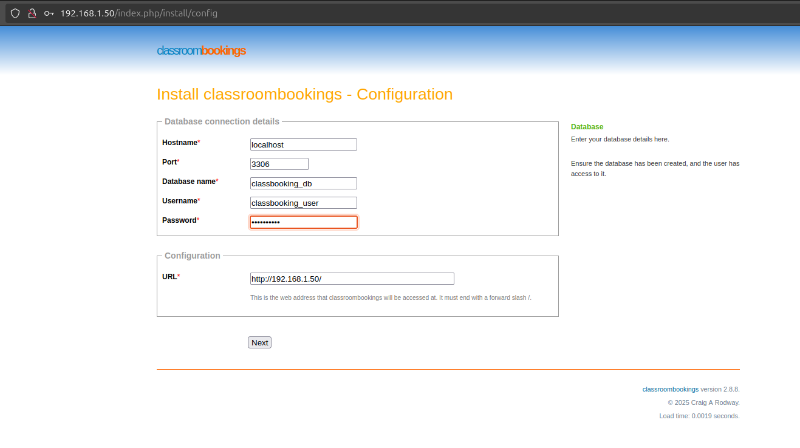
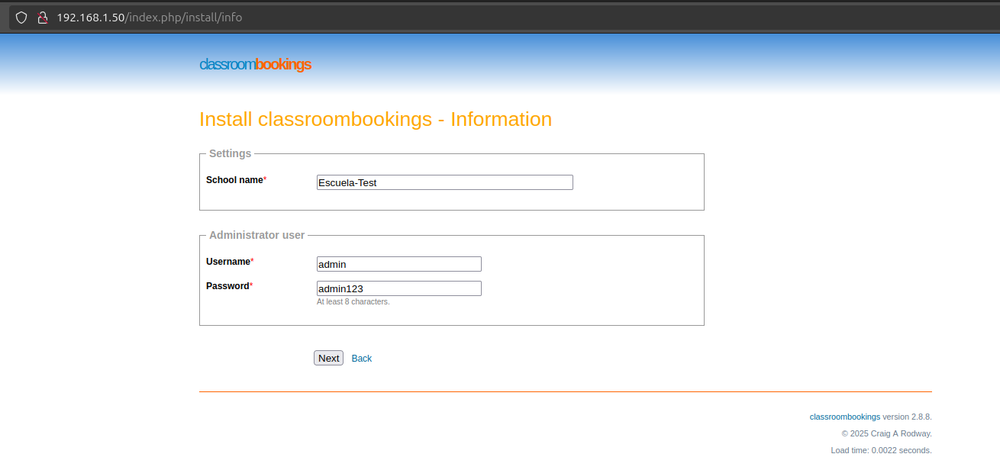
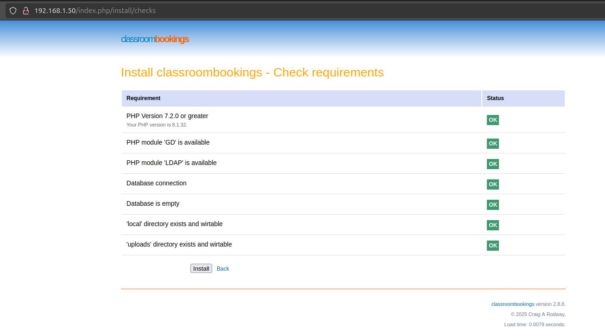

# Classroombookings

**Guía de instalación de Classroombookings para sistemas basados en Debian**

## Requisitos

- Servidor web: Apache, Nginx o IIS
- Versiones compatibles de PHP: 7.2 - 8.1
- Módulos PHP requeridos: `mysql` / `mysqli` / `pdo_mysql` y `gd`
- Módulos PHP opcionales: `ldap`
- Bases de datos compatibles: MySQL 5.7, MySQL 8, MariaDB 5 o MariaDB 10
- Permisos de escritura habilitados en los directorios correspondientes
- Módulo `mod_rewrite` de Apache (opcional)

---

## Instalación y configuración de los requisitos

En este ejemplo se utilizará Apache2 como servidor web, pero también es posible utilizar Nginx. Para mayor información sobre las diferencias entre ambos, consulte la [documentación oficial](https://www.classroombookings.com/docs/self-hosted/requirements/).

Antes de comenzar con la instalación, actualice el sistema ejecutando:

```bash
sudo apt update && sudo apt upgrade -y
```

> **Nota:** Si desea utilizar un nombre diferente en lugar de `classbooking`, asegúrese de reemplazarlo en cada instancia a lo largo de la guía.

---

### Configuración del servidor web (Apache2)

Instale Apache:

```bash
sudo apt install apache2 -y
```

Cree un archivo de configuración para el sitio:

```bash
sudo nano /etc/apache2/sites-available/classbooking.conf
```

Seleccione una de las siguientes opciones:

#### Con certificado SSL

Si quieres utilizar un certificado autofirmado ejecuta lo siguiente:

```bash
sudo openssl req -x509 -nodes -days 365 -newkey rsa:2048 -keyout /etc/ssl/private/classbooking-ssl.key -out /etc/ssl/certs/classbooking-ssl.crt
```

```apache
<VirtualHost *:443>
        ServerName classbooking.test
        DocumentRoot /var/www/classbooking
        ErrorLog ${APACHE_LOG_DIR}/error.log
        CustomLog ${APACHE_LOG_DIR}/access.log combined
        SSLEngine on
        SSLCertificateFile /etc/ssl/certs/classbooking-ssl.crt
        SSLCertificateKeyFile /etc/ssl/private/classbooking-ssl.key
</VirtualHost>
```

#### Sin certificado SSL

```apache
<VirtualHost *:80>
        ServerName classbooking.test
        DocumentRoot /var/www/classbooking
        ErrorLog ${APACHE_LOG_DIR}/error.log
        CustomLog ${APACHE_LOG_DIR}/access.log combined
</VirtualHost>
```

Habilite el nuevo sitio y desactive el predeterminado:

```bash
sudo mkdir /var/www/classbooking
sudo a2dissite 000-default.conf
sudo a2ensite classbooking.conf
```

---

## Instalación del sistema de bases de datos

Elija entre las siguientes opciones:

### MySQL

```bash
sudo apt install mysql-server -y
```

### MariaDB

```bash
sudo apt install mariadb-server -y
```

Una vez instalado el servidor, acceda a la consola de MySQL:

```bashBuena
Principales desventajas

mysql -u root -p
```

o

```bash
sudo mysql
```

Cree la base de datos y el usuario correspondientes:

```sql
CREATE DATABASE classbooking_db;
CREATE USER 'classbooking_user'@'localhost' IDENTIFIED BY 'contraseña';
GRANT ALL ON classbooking_db.* TO 'classbooking_user'@'localhost';
FLUSH PRIVILEGES;
EXIT;
```

---

## Instalación de PHP y módulos necesarios

Agregue el repositorio y actualice los paquetes:

```bash
sudo add-apt-repository ppa:ondrej/php
sudo apt update
```

Instale PHP y los módulos requeridos:

```bash
sudo apt install php8.1 php8.1-mysql php8.1-gd php8.1-ldap -y
```

---

## Descarga de Classbooking

> **Nota:** Puede utilizar herramientas alternativas en lugar de `wget` y `unzip`.

```bash
sudo apt install wget unzip -y
cd /var/www/classbooking
sudo wget https://github.com/classroombookings/classroombookings/archive/refs/tags/v2.8.8.zip
sudo unzip v2.8.8.zip && sudo rm -f v2.8.8.zip
sudo mv classroombookings-2.8.8/* . && sudo rm -rf classroombookings-2.8.8
```

---

## Asignación de permisos

Otorgue los permisos adecuados al usuario del servidor web (`www-data`):

```bash
sudo chown -R www-data:www-data '/var/www'
sudo chmod -R 660 '/var/www'
sudo find '/var/www' -type d -exec chmod 2770 {} +
```

---

## Reinicio del servicio Apache

```bash
sudo systemctl restart apache2
```

---

## Instalación de Classbooking desde el navegador

Abra su navegador web y acceda a la dirección IP o URL del servidor. Debería visualizarse la pantalla de configuración inicial. Complete los campos de la siguiente manera:

- **Hostname:** Nombre del servidor de base de datos
- **Port:** Puerto de conexión (por defecto: `3306`)
- **Database name:** `classbooking_db` (según esta guía)
- **Username:** `classbooking_user`
- **Password:** Contraseña asignada al usuario

> ⚠️ **Importante:** Verifique que la URL autodetectada por el sistema sea correcta.



Haga clic en "Next". En la siguiente pantalla, complete los siguientes campos:

- **School name:** Nombre de la institución
- **Username:** Nombre de usuario administrador
- **Password:** Contraseña del usuario administrador



Presione "Next" nuevamente. El sistema verificará las dependencias necesarias. Si todas están satisfechas, haga clic en `Install`.



Una vez completada la instalación, el sistema debería redirigir automáticamente a la pantalla de inicio de sesión. Si no lo hace, acceda manualmente introduciendo nuevamente la IP o URL en el navegador.

## Ventajas, Desventajas y opinión

Pricipales ventajas:

- Facilidad de instalación
- Buena compatibilidad
- Software libre (AGLP-3.0 license)
- Integración con LDAP
- Buena gestión de las reservas
- Base de datos SQL

Principales desventajas:

- UI tosca y poco llamativa
- Unicamente en inglés
- Pocas opciones de configuración

Opinión:

Desde mi punto de vista es fácil y rápido de implentar así como de comenzar a gestionar las reservas de las clases, aunque, su interfaz es un poco incómoda de utilizar y visualmente deja que desear, es una buena app de gestión de reservas ya que tiene una buena organización y filtrado de los datos. Como siempre hay alternativas como puede ser [LibreBooking](https://github.com/LibreBooking/app) que tiene un enfoque más general a diferencia de classroombooking que fue diseñada espeficicamente para reserva de clases.
